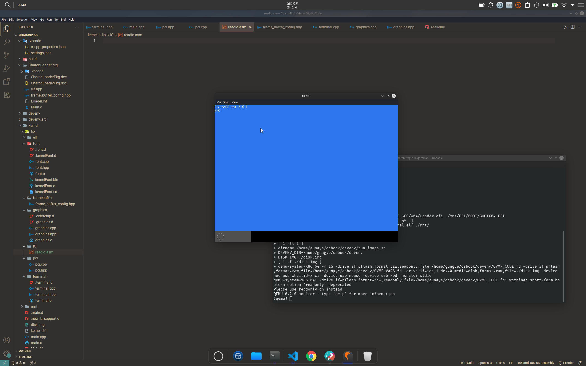

# CharonOS
 a 64-bit kernel


### This kernel is a modified and adapted version of [mikanos](https://github.com/uchan-nos/mikanos), an educational operating system, with some added features. 


#### Changes
1. Working in MacOS
2. Add a folder structure
3. Add a shape function
4. Aggregate build system (build.sh)
5. Comments on function behavior descriptions


<br>

## UPDATE v0.0.6
1. 메모리 메니저 추가
2. 페이징 구현
3. 메모리 맵 구조 구현
4. Newlib 포팅


<br>
<br>

## Try CharonOS
#### download Link -> [CLICK](https://mega.nz/folder/xPNRHJgA#9E65uT5mDGZYAwXpMhv_pQ)

<br>

#### HOWTOEXECUTE

```bash
qemu-system-x86_64 \
    -m 1G \
    -drive if=pflash,format=raw,readonly,file=OVMF_CODE.fd \
    -drive if=pflash,format=raw,file=OVMF_VARS.fd \
    -drive if=ide,index=0,media=disk,format=raw,file=disk.img \
    -device nec-usb-xhci,id=xhci \
    -device usb-mouse -device usb-kbd \
    -monitor stdio \
    $QEMU_OPTS
```
<br>
<br>

## Images

